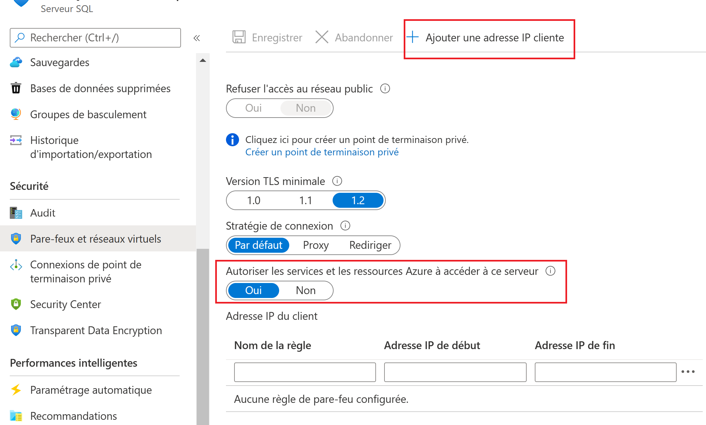

# Déploiement du kit démarrage sur un environnement Cloud Microsoft Azure, et mise en place de l’intégration en continu à l’aide de GitHub Actions

Ce guide illustre le déploiement du kit de démarrage dans un environnement Microsoft Azure, ainsi que l'automatisation de ce processus à l'aide d'une pipeline de *CI/CD* GitHub Actions. Le canevas peut également être déployé dans d'autres environnements, mais ces scénarios ne sont pas couverts dans ce document.

## Sommaire

- [Mise en place de l'environnement Azure](#mise-en-place-de-lenvironnement-azure)
- [Déploiement](#déploiement)
  - [A. Déploiement manuel à l'aide de Visual Studio 2019](#a-déploiement-manuel-à-laide-de-visual-studio-2019)
  - [B. Déploiement manuel à l'aide de Visual Studio Code](#b-déploiement-manuel-à-laide-de-visual-studio-code)
  - [Exécution manuelle de la migration d'une base de données](#exécution-manuelle-de-la-migration-dune-base-de-données)
    - [Préparation de l'environnement SQL sur Azure](#préparation-de-lenvironnement-sql-sur-azure)
    - [Exécution de la migration depuis la machine locale](#exécution-de-la-migration-depuis-la-machine-locale)
- [Intégration et déploiement en continu à l’aide de pipeline CI/CD GitHub Actions](#intégration-et-déploiement-en-continu-à-laide-de-pipeline-cicd-github-actions)
  - [Conditions d'activation](#conditions-dactivation)
  - [Mise en place des variables d’environnement & secrets GitHub](#mise-en-place-des-variables-denvironnement--secrets-github)
    - [1. Obtenir le profil de publication](#1-obtenir-le-profil-de-publication)
    - [2. Renseigner un secret sur GitHub](#2-renseigner-un-secret-sur-github)

## Mise en place de l'environnement Azure

Pour déployer le fournisseur de service (FS) dans l’environnement Microsoft Azure, vous allez devoir créer une nouvelle application web.
Vous devez disposer pour cela d’un compte Microsoft Azure.
> Avant de continuer, si vous ne possédez pas d’un compte Azure, nous vous invitons à vous rendre à l’adresse [https://aka.ms/free](aka.ms/free) afin d’en créer un, gratuitement.

Pour créer l’application web relative à votre fournisseur de service dans Microsoft Azure, procédez comme suit :

1. Ouvrez une session de navigation et connectez-vous sur le [portail Azure][azure-portal]
2. Cliquez sur ***Nouveau***.
3. Dans la catégorie Web, choisissez ***Web App***.
4. Renseignez les champs demandés, tels que le choix du système d’exploitation et le plan App Service correspondant à votre charge.
  

   > Note : Sur Azure, une application web sous Windows dispose de fonctionnalités avancées non disponibles sous un hôte Linux.
   >
   > C'est pourquoi, à la date de rédaction de ce document, l'option recommandée est de sélectionner un hôte Windows. Néanmoins, le starter kit est bien sûr fonctionnel sous chacun des deux systèmes d'exploitation.

5. Une fois votre application crée, rendez-vous dans les paramètres de configuration de celle-ci et ajoutez les couples clé-valeur suivants avec l'option ***Nouveau paramètre d'application*** :

   `FranceConnect__ClientSecret : <Votre client_secret FranceConnect>`, et

   `DOTNET_ENVIRONMENT : <Development/Staging/Production>`, au choix selon l’environnement désiré.

    

6. Le cas échéant, configurez votre base de données ***SQL Server*** et ajoutez votre chaîne de connexion dans les paramètres de configurations, cette fois à l'aide de l'option ***Nouvelle chaîne de connexion***. Nommez la **DefaultConnection**.

> Le starter kit est configuré pour nécessiter dans un environnement de production la connexion à une base de données SQL Server.
>
> Il est conseillé de déployer celle-ci sur Azure. Pour ce faire, depuis le portail Azure, choisissez ***Nouveau > Base de données > SQL Database***, et configurez soigneusement votre serveur et base de données. Veillez à conserver les identifiants renseignés, et à allouer la capacité en fonction de la charge attendue.
>
> Les chaînes de connexion peuvent alors être obtenues en se rendant dans les paramètres de la base de données ainsi créée, et en sélectionnant l'onglet ***Chaînes de connexion***. Récupérez ainsi la chaîne de connexion .NET proposée, en la complétant à l'aide de vos identifiants.

## Déploiement

### A. Déploiement manuel à l'aide de Visual Studio 2019

> **Prérequis** :
>
> - Un ordinateur sous Windows ou Windows Server, atteignant les [prérequis à l'installation de Visual Studio](https://docs.microsoft.com/fr-fr/visualstudio/releases/2019/system-requirements#visual-studio-2019-system-requirements)
> - N'importe quelle édition de Visual Studio 2019, installée avec la charge de travail ***Développement Web et ASP.NET***. Les visuels varient légèrement pour des versions de Visual Studio différentes, telles que Visual Studio 2017 ou 2022.

Pour publier votre fournisseur de service dans Microsoft Azure depuis Visual Studio 2019, procédez comme suit :

1. Dans l'**explorateur de solutions** Visual Studio (sur la droite par défaut), faites un clic droit sur votre projet et sélectionnez ***Publish***
2. Créez un nouveau profil de publication en sélectionnant ***New*** ou ***Add a publish profile***


3. Sélectionnez ***Azure***, puis ***Azure App Service*** sous Windows ou Linux, selon l’option que vous avez choisi lors de la création de votre web app sur le portail Azure

4. Sélectionnez l’application web que vous avez créé précédemment.
5. Sélectionnez ***Publish*** puis ***Finish***.
6. Le profil de publication est prêt, et le statut de ce dernier s'affiche. Vous pouvez alors personnaliser la configuration à l'aide de l'option **Show all settings**


7. Vérifiez la bonne configuration de l'application.
  
   Si vous déployez vers un environnement de production, cochez la case **Apply this migration on publish**, en renseignant la chaîne de connexion à la base de données dans le champ de texte, afin que la base de données soit initialisée si nécessaire lors de la publication
   
   > Cette option n'est aujourd'hui disponible uniquement dans le cas d'un déploiement vers un hôte Windows. Dans le cas contraire, il faudra effectuer manuellement cette opération.
   >
   > La procédure pour ce faire est indiquée dans la section [Exécution manuelle de la migration d'une base de données](#exécution-manuelle-de-la-migration-dune-base-de-données)

8. Une fois tous les paramètres confirmés et sauvegardés, publier l’application est réalisable à l’aide du bouton **Publish** sur l'écran de statut du profil de publication.

### B. Déploiement manuel à l'aide de Visual Studio Code

> **Prérequis** :
>
> - Un ordinateur atteignant les [prérequis pour à l'installation de Visual Studio Code](https://code.visualstudio.com/Docs/supporting/requirements#_platforms)
> - La dernière version de Visual Studio Code
> - Une familiarité avec un environnement ligne de commande de son choix.
> - L'extension [C# pour VS Code](https://marketplace.visualstudio.com/items?itemName=ms-dotnettools.csharp)
> - L'extension [Azure App Service pour VS Code](https://marketplace.visualstudio.com/items?itemName=ms-azuretools.vscode-azureappservice)
> - Le [SDK .NET Core](https://dotnet.microsoft.com/download)

1. Ouvrez votre dossier projet sous VS Code, et naviguez une session ligne de commande vers ce dossier. Cela peut être réalisé rapidement avec un clic droit sur le dossier projet, puis l'option **Open in Integrated Terminal**
   

2. Dans le terminal qui s'affiche alors, lancez la commande ```dotnet publish --output "publish"```.
3. Une fois le processus complété, retrouvez le dossier "publish" sur l'explorateur de VS Code, cliquez droit dessus et sélectionnez "Deploy to Web App


4. Choisissez alors votre souscription, ainsi que la web app précédemment crée, afin de lancer le déploiement.

5. Une fois votre application web prête, une notification vous propose de naviguer dessus. Selon votre environnement, il faut le cas échéant initialiser les tables de la base de données en exécutant une migration.

### Exécution manuelle de la migration d'une base de données

La migration d'une base de données est l'opération qui fait passer la base de données à un état initial (vide, par exemple), à un état désiré, avec les tables et contraintes attendues. Ces opérations sont gérées par Entity Framework Core.

Pour lancer cette migration avec succès, il faut tout d'abord que le serveur de base de données concerné accepte les connexions de notre machine.

#### **Préparation de l'environnement SQL sur Azure**

Pour un serveur SQL instancié dans le Portail Azure, il faut configurer le pare feu comme suit :

1. Depuis le portail Azure, ouvrez la ressource correspondant à votre serveur SQL.
2. Ouvrez alors l'onglet ***Pare-feu et réseaux virtuels***, situé dans la section Sécurité.
3. Ajoutez alors l'adresse IP de votre machine dans la liste des adresses autorisés par le pare feu. Cela peut être effectué simplement à l'aide du bouton ***Ajouter une adresse IP Cliente***, qui ajoute votre adresse IP actuelle dans la liste des adresses autorisées.
4. Si vous souhaitez automatiser le déploiement à l'aide de pipeline CI/CD comme GitHub Actions ou Azure DevOps, activez l'option ***Autoriser les services et les ressources Azure à accéder à ce serveur***
5. Enregistrez vos changements.



> Si ce n'est pas déjà fait, récupérez également la chaîne de connexion à votre base de données, en vous rendant dans les paramètres de la base de données (et non du serveur comme ci-dessus), et en sélectionnant l'onglet chaînes de connexion. Récupérez ainsi la chaîne de connexion .NET proposée, en la complétant à l'aide de vos identifiants.

#### **Exécution de la migration depuis la machine locale**

> Prérequis :
>
> - Le [SDK .NET Core](https://dotnet.microsoft.com/download), installé automatiquement avec Visual Studio, ou manuellement.
> - Une familiarité avec l'environnement ligne de commande de votre choix.
> - Une machine capable de communiquer avec le serveur SQL (donc autorisée par les différents pares-feux, comme mis en place dans la section précédente.)

1. Ouvrez une session en ligne de commandes de votre choix dans le dossier contenant les fichiers source du projet, tel que le fichier .csproj.
2. Utilisez la commande `dotnet tool restore` afin d'installer les outils en ligne de commande d'Entity Framework Core dans l'environnement de votre projet.
   > Alternativement, vous pouvez les installer globalement sur votre système à l'aide de la commande `dotnet tool install --global dotnet-ef`
3. Sauvegardez la chaîne de connexion à votre base de données dans une variable d'environnement temporaire.
   Sous PowerShell, cela se réalise comme ceci :

    ```PowerShell
    $env:ConnectionStrings:DefaultConnection="VotreChaîneDeConnexion"
    ```

    Sous Bash, cela s'effectue sans guillemets, comme suit :

    ```Bash
    export ConnectionStrings__DefaultConnection=VotreChaîneDeConnexion
    ```

4. De la même façon, créez une variable d'environnement **ASPNETCORE_ENVIRONMENT**, à la valeur "Production" afin d'exécuter la migration sur l'environnement de Production avec la base de données renseignée.
5. Dans la même session ligne de commandes, exécutez enfin la commande `dotnet ef database update`, afin de lancer la migration de la base de données.

## Intégration et déploiement en continu à l’aide de pipeline CI/CD GitHub Actions

Un fichier workflow GitHub Actions est préconfiguré sur ce répertoire GitHub, sous [.github/workflows/build-and-deploy.yml](../.github/workflows/build-and-deploy.yml) , et définit une pipeline dont l’objectif est de compiler, tester le cas échéant, et déployer l’application.
Ce fichier s’architecture comme suit :

```yml
name: # Nom de la pipeline 
on:
  # Conditions d'activation
env:
  # Variables d'environnement
jobs:
  # Taches à réaliser
```

Les taches réalisées dans « jobs » sont la compilation et la publication de l’application empaquetée sous forme d’artefact sur GitHub (accessible en cliquant sur l’action dont on souhaite récupérer l’artefact), puis, le cas échéant, le déploiement sur Azure de cette application (dans le cas d’un push de code sur les branches principales), ainsi que la migration des bases de données associées si nécessaire.

### Conditions d'activation

Ici, la première entrée « workflow_dispatch » indique que la pipeline peut être lancée manuellement d’un clic dans l’interface web GitHub.

La seconde ajoute que chaque Pull Request apportant des changements de fichiers dans le chemin ‘Source/**’ mènera à un lancement de la pipeline.

Et enfin, « push » précise que tout push de code source sur les branches main & develop aura le même effet.
Il convient de bien configurer les branches applicables à la condition « push », afin que seules les branches stables mènent à un déploiement sur Azure le cas échéant

### Mise en place des variables d’environnement & secrets GitHub

Il est ici possible d’indiquer les variables d’environnement & secrets à utiliser pour le fonctionnement de la pipeline.
Là aussi, il convient de personnaliser chacun des paramètres. Le nom de l’application Azure, tout comme le chemin d’accès, la version de .NET, ou encore le profil de publication Azure.

``` yml
env:
  CONNECTIONSTRINGS__DEFAULTCONNECTION: ${{ secrets.database_connection_string }}
  AZURE_WEBAPP_PUBLISH_PROFILE: ${{ secrets.webapp_publish_profile }}
  AZURE_WEBAPP_NAME: franceconnect-service-provider-dotnet-webapp-aspnetcore
  AZURE_WEBAPP_PACKAGE_PATH: Source/WebApp-Service-Provider-DotNet/publish
  WORKING_DIRECTORY: Source/WebApp-Service-Provider-DotNet/
  CONFIGURATION: Debug
  ASPNETCORE_ENVIRONMENT: Development
  DOTNET_CORE_VERSION: 3.1.x
```

Les chaînes de connexion et profil de publication étant des valeurs sensibles, il convient de les définir en tant que « secret » afin qu’ils ne soient pas visibles en clair par des personnes qui consulteraient le code. Cela est réalisable comme suit.

#### 1. **Obtenir le profil de publication**

Sur le [portail Azure][azure-portal], retrouvez l’App Service correspondant à votre application, que vous avez créé dans l’étape précédente.
Vérifiez bien que le nom de l'application est celui que vous avez indiqué dans la variable « AZURE_WEBAPP_NAME » du fichier définissant la GitHub Action, et que les couples clés valeurs de configuration sont bien renseignés.

Ensuite, dans l’onglet « Vue d’ensemble », Téléchargez le profil de publication avec le bouton correspondant, « Obtenir le profil de publication ».


Conservez ce document en lieu sûr, car celui-ci permet à toute personne en sa possession de déployer une application sur cette web app Azure, ainsi que de lire vos données de configuration & secrets.

Copiez le contenu du document dans votre presse-papiers.

#### 2. **Renseigner un secret sur GitHub**

Ouvrez les paramètres de votre répertoire GitHub, et rejoignez l’onglet « Secrets ».


Vous pouvez alors ajouter un secret avec le bouton dédié ***New repository secret***.

Ajoutez ainsi le contenu de votre profil de publication dans un secret nommé **WEBAPP_PUBLISH_PROFILE**


Ajoutez de la même façon votre chaîne de connexion à la base de données dans un secret ***DATABASE_CONNECTION_STRING***, le cas échéant, afin que la migration de la base de données soit effectuée lors de l'exécution de la pipeline.

> Note : Pour cela, veillez à ce que le pare-feu de votre serveur SQL soit configuré pour **autoriser les services et les ressources Azure** à y accéder. Le processus est mentionné dans la section [Exécution Manuelle d'une base de données > Préparation de l'environnement SQL sur Azure](#préparation-de-lenvironnement-sql-sur-azure)

Une fois ces variables prêtes, la pipeline sera donc lancée selon les conditions d’activation précédemment configurée, ou manuellement par le biais de l’interface GitHub, dans l’onglet ***Actions***, comme illustré ci-après.


[azure-portal]: https://portal.azure.com/ "Portail Azure"
