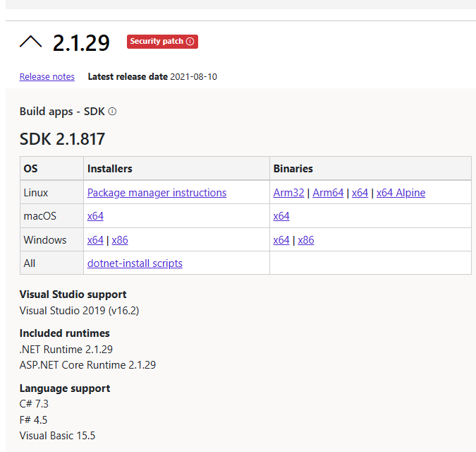

# Chemin de migration raccourci d'un ancien fournisseur de service sous ASP.NET Core 1 Preview 2 vers ASP.NET Core 3.1

## Sommaire

- [Sommaire](#sommaire)
- [Migration de ASP.NET Core 1 Preview 2 vers ASP.NET Core](#migration-de-aspnet-core-1-preview-2-vers-aspnet-core)
- [Chemin de migration raccourci vers la version .NET Core 3.1 (LTS)](#chemin-de-migration-raccourci-vers-la-version-net-core-31-lts)
  - [Migration des propriétés projet et des dépendances de l'application](#migration-des-propriétés-projet-et-des-dépendances-de-lapplication)
    - [Propriétés du Projet](#propriétés-du-projet)
    - [Dépendances du Projet](#dépendances-du-projet)
  - [Fichier principal Program.cs](#fichier-principal-programcs)
  - [Mise à niveau des fichiers de démarrage et de configuration](#mise-à-niveau-des-fichiers-de-démarrage-et-de-configuration)
  - [Configuration de FranceConnect sous ASP.NET Core](#configuration-de-franceconnect-sous-aspnet-core)
  - [Configuration du déploiement avec web.config et des librairies client avec npm](#configuration-du-déploiement-avec-webconfig-et-des-librairies-client-avec-npm)
    - [Mise à jour du fichier web.config](#mise-à-jour-du-fichier-webconfig)
    - [Mise à jour du mécanisme de préparation des fichiers statiques](#mise-à-jour-du-mécanisme-de-préparation-des-fichiers-statiques)
  - [Changements généraux du code d'authentification](#changements-généraux-du-code-dauthentification)

## Migration de ASP.NET Core 1 Preview 2 vers ASP.NET Core

Afin de mettre à jour le format de projet .NET Core Preview (.xproj) vers un projet au format standard .NET Core (.csproj), nous devons effectuer une première migration. Le format des fichiers de configuration et dépendances change, et cette première étape de migration permet l’ouverture du projet depuis les outils grand public à jour, tels que Visual Studio 2019, avant de continuer la migration.

Pour effectuer cette migration, nous utilisons un outil en ligne de commande du SDK .NET Core, appelé [dotnet migrate](https://docs.microsoft.com/dotnet/core/tools/dotnet-migrate). Cet outil requiert une version 1.x ou 2.x du SDK .NET Core installée. À cette fin, il est recommandé d’installer la dernière version du SDK .NET Core 2.1 LTS, disponible à [cette adresse](https://dotnet.microsoft.com/download/dotnet/2.1). Récupérez et exécutez le programme d'installation correspondant à votre système d'exploitation


> A la date de publication de ce guide, la dernière version du SDK est la version 2.1.817, qui sera utilisée pour la suite.

Afin d'exécuter cette commande, il convient de déclarer le SDK installé à utiliser. Cette déclaration s'effectue dans le fichier global.json situé au même emplacement que le fichier solution .sln , dans notre cas situé sous `Source/WebApp-Service-Provider-DotNet-1.0/`.
Pour cela, nous remplaçons la version du SDK indiquée dans ce fichier par celle précédemment installée, 2.1.817 dans notre cas.

> Indiquez bien une version non-préversion du SDK 1.x ou 2.x, faute de quoi la commande `dotnet migrate` ne s'exécutera pas.

`global.json`

```diff
{
  "projects": [ "src", "test" ],
  "sdk": {
-    "version": "1.0.0-preview2-003121"
+    "version": "2.1.816"
  }
}
```

Une fois cette version précisée, il faut par la suite lancer une invite de commande dans ce même dossier, et y lancer l’instruction

```bash
dotnet migrate
```

La commande une fois exécutée, le projet est désormais compatible avec des outils tels que Visual Studio 2019 ou Visual Studio Code, et prêt à être migré vers des versions ultérieures de .NET Core.

## Chemin de migration raccourci vers la version .NET Core 3.1 (LTS)

Il est conseillé de migrer directement à .NET Core 3.1 et ainsi éviter de nombreuses étapes de migrations intermédiaires non nécessaires, notamment dû à la façon dont la déclaration des dépendances est réalisée, et a été significativement simplifiée sous les versions ultérieures de .NET Core, telles que 3.1.

> Ce chemin de migration couvre les fonctionnalités implémentées dans le canevas. Le cas échéant, il peut être désirable de consulter les changements notables des différentes versions, afin de pouvoir migrer au besoin les autres composants d’une large application. La [documentation de Microsoft](https://docs.microsoft.com/en-us/aspnet/core/migration/1x-to-2x/?view=aspnetcore-5.0) recense ces changements et constitue à ce titre un bon point de départ.

Avant de réaliser la migration, il faut à nouveau commencer par installer le SDK de la version concernée. Il est ainsi conseillé d’utiliser la dernière version du SDK .NET Core 3.1 (LTS), disponible à [cette adresse](https://dotnet.microsoft.com/download/dotnet/3.1).

> Vous pouvez retrouver l'ensemble des changements à l'aide de l'outil diff appliqué sur ce répertoire git, [ici entre la version 1.0 et la version 3.1](https://github.com/FranceConnectSamples/franceconnect-service-provider-dotnet-webapp-aspnetcore/compare/DotNetCore-1.0-partial-migration...v2-RC-DotNetCore-3.1)

### Migration des propriétés projet et des dépendances de l'application

#### Propriétés du Projet

Commençons par mettre à jour le projet pour cibler ASP.Net Core 3.1, en éditant le fichier projet `.csproj`, situé dans le dossier du code source. Il convient également de supprimer la restriction de version au runtime, et la propriété `PackageTargetFallback`.

<details>
  <summary>Changements de code - cliquez pour étendre</summary>
  
```diff
-    <TargetFramework>netcoreapp1.0</TargetFramework>
+    <TargetFramework>netcoreapp3.1</TargetFramework>
-    <RuntimeFrameworkVersion>1.0.4</RuntimeFrameworkVersion>
-    <PackageTargetFallback>…</PackageTargetFallback>
```

</details>

\
Le fichier est disponible sur ce répertoire GitHub, sous `/Source/WebApp-Service-Provider-DotNet/WebApp-Service-Provider-DotNet.csproj`, [ici](https://github.com/FranceConnectSamples/franceconnect-service-provider-dotnet-webapp-aspnetcore/blob/v2-RC2-DotNetCore-3.1/Source/WebApp-Service-Provider-DotNet/WebApp-Service-Provider-DotNet.csproj#L3-L9)

> Attention : Dû à un bug lié à l’execution d’application .NET Core 3.1 sous IIS, il est important de s’assurer que le nom de l’application ne se termine pas par « dotnet ».
Cela se répercute ainsi sur le fichier `.csproj` de notre application
>
> ```diff
> -  <AssemblyName>WebApp-Service-Provider-DotNet</AssemblyName>
> +  <AssemblyName>WebApp-Service-Provider</AssemblyName>
> -  <PackageId>WebApp-Service-Provider-DotNet</PackageId>
> +  <PackageId>WebApp-Service-Provider</PackageId>
> ```

#### Dépendances du Projet

Le système de dépendances et références de .NET Core a connu de nombreux changements depuis la version 1.0.
Aussi, le plus simple afin d’éviter un long processus de mises à jour de packages interdépendants, est de passer directement à .NET Core 3.1, qui apporte des améliorations grâce au métapackage Microsoft.AspNetCore.App implicitement référencé.
De nombreuses références first-party sont désormais incluses dans ce métapackage, qui invoquera au runtime les librairies nécessaires depuis le runtime .NET Core installé sur l’hôte.
Il est ainsi possible de réduire les déclarations de dépendances utilisées dans notre canevas aux suivantes.

<details>
  <summary>Changements de code - cliquez pour étendre</summary>
  
```xml
<ItemGroup>
    <PackageReference Include="Microsoft.AspNetCore.Authentication.OpenIdConnect" Version="3.1.17" />
    <PackageReference Include="Microsoft.AspNetCore.Diagnostics.EntityFrameworkCore" Version="3.1.17" />
    <PackageReference Include="Microsoft.AspNetCore.Identity.EntityFrameworkCore" Version="3.1.17" />
    <PackageReference Include="Microsoft.EntityFrameworkCore.InMemory" Version="3.1.17" />
    <PackageReference Include="Microsoft.EntityFrameworkCore.SqlServer" Version="3.1.17" />
    <PackageReference Include="Microsoft.EntityFrameworkCore.Tools" Version="3.1.17">
        <PrivateAssets>all</PrivateAssets>
        <IncludeAssets>runtime; build; native; contentfiles; analyzers; buildtransitive</IncludeAssets>
    </PackageReference>
    <PackageReference Include="Microsoft.Extensions.Logging.Console" Version="3.1.17" />
    <PackageReference Include="IdentityModel" Version="5.1.0" />
    <PackageReference Include="Microsoft.VisualStudio.Web.BrowserLink" Version="2.2.0" />
    <PackageReference Include="Microsoft.VisualStudio.Web.CodeGeneration.Design" Version="3.1.5" PrivateAssets="All" />
</ItemGroup>
```

</details>

\
Le fichier complet résultant est visualisable sous [Source/WebApp-Service-Provider-DotNet/WebApp-Service-Provider-DotNet.csproj]
(https://github.com/FranceConnectSamples/franceconnect-service-provider-dotnet-webapp-aspnetcore/blob/v2-RC2-DotNetCore-3.1/Source/WebApp-Service-Provider-DotNet/WebApp-Service-Provider-DotNet.csproj#L18-L34)

### Fichier principal Program.cs

Le fichier Program.cs générique dispose d’un nouveau format simplifié, que nous pouvons reproduire, comme réalisé dans le fichier [`Source/WebApp-Service-Provider-DotNet/Program.cs`](https://github.com/FranceConnectSamples/franceconnect-service-provider-dotnet-webapp-aspnetcore/blob/0d5e40fd04a15fc4cfa5a6bf93384e30e82c950c/Source/WebApp-Service-Provider-DotNet/Program.cs#L33-L51) de ce répertoire

Pour ajouter des sources de configuration supplémentaires, ou un logging sur console, cela est désormais réalisable comme suit

<details>
  <summary>Changements de code - cliquez pour étendre</summary>

```csharp
public static IHostBuilder CreateHostBuilder(string[] args) =>
    Host.CreateDefaultBuilder(args)
    .ConfigureLogging(logging =>
    {
        logging.ClearProviders();
        logging.AddConsole();
    })
    .ConfigureAppConfiguration((hostingContext, config) =>
    {
        config.AddJsonFile("MyConfig.json");
        config.AddEnvironmentVariables();
    })
    .ConfigureWebHostDefaults(webBuilder =>
    {
        webBuilder.UseStartup<Startup>();
    });
```

Sans oublier les imports nécessaires :

```csharp
using Microsoft.Extensions.Hosting;
using Microsoft.Extensions.Configuration;
using Microsoft.Extensions.Logging;
```

</details>

### Mise à niveau des fichiers de démarrage et de configuration

Le constructeur de la classe Startup est simplifié également : tout le code écrit précédemment pour obtenir les configurations des divers fichiers appsettings.json, variables d’environnement, et user secrets, est désormais effectué par défaut par le framework avec l'instruction `CreateDefaultBuilder` ajoutée dans la classe `Program` à la section précédente.
Ainsi, le constructeur dans Startup.cs est réduit à ceci

<details>
  <summary>Changements de code - cliquez pour étendre</summary>
  
```csharp
 public Startup(IConfiguration configuration, IWebHostEnvironment env)
        {
            Env = env;
            Configuration = configuration;
        }

        public IConfiguration Configuration { get; set; }
        public IWebHostEnvironment Env { get; set; }
```

</details>

\
Ajouter des sources de configuration supplémentaires, si besoin, est désormais réalisable dans le fichier `Program.cs`, comme indiqué dans la section précédente.

Les fonctions de configuration changent de façon significative cependant. L’authentification se déclare désormais en tant que service, dans la fonction ConfigureServices, et la fonction Configure n’a ainsi plus besoin d’interagir avec les options de configuration FranceConnect.  

Les méthodes `AddMvc` et `UseMvc` sont également migrées vers les méthodes `AddControllersWithViews` et `UseEndpoints`, et l'authentification passe désormais par l'appel des méthodes `AddAuthentication` `UseAuthentication`

Le fichier Startup.cs répertoriant ces changements est fourni dans ce répertoire, sous [Source/WebApp-Service-Provider-DotNet/Startup.cs](https://github.com/FranceConnectSamples/franceconnect-service-provider-dotnet-webapp-aspnetcore/blob/v2-RC2-DotNetCore-3.1/Source/WebApp-Service-Provider-DotNet/Startup.cs)

### Configuration de FranceConnect sous ASP.NET Core

La configuration de FranceConnect a beaucoup évolué pour refléter les mises à jour à la fois des spécifications .NET Core et de celles de FranceConnect.

Cette configuration a été extraite dans sa propre fonction, dans le fichier [Startup.cs](https://github.com/FranceConnectSamples/franceconnect-service-provider-dotnet-webapp-aspnetcore/blob/v2-RC2-DotNetCore-3.1/Source/WebApp-Service-Provider-DotNet/Startup.cs#L152), qui documente l'ensemble des paramètres définis.

Il est à noter que pour le développement local, un set de crédentités est fourni par FranceConnect avec plusieurs limitations. Il a été implémenté dans ce kit et est documenté à l'adresse <https://partenaires.franceconnect.gouv.fr/fcp/fournisseur-service#sign_in>.

Les changements notables incluent :

- Les url de callback login, logout, et data, de notre kit sont désormais configurables dans le fichier `app.settings`, ce qui permet de choisir et déclarer les adresses de callback sur l’espace projet FranceConnect
- FranceConnect n’accepte pas certains paramètres inconnus dans une requête, il faut donc désactiver plusieurs options sur .NET Core 3.1 pour empêcher l’envoi de paramètres additionnels.
- La déconnexion requiert l’envoi à FC du paramètre `id_token_hint` contenant l’id_token de l’utilisateur à déconnecter. Qui plus est, à la date de publication de ce guide, le nonce transmis lors de la requête d'authentification ne doit pas inclure de caractère "`.`", ou l'étape de déconnexion renvoie une erreur E000031 de FranceConnect.
- Les claims à recevoir doivent être pré-déclarés dans l’application .NET Core
- Des changements liés aux cookies s'appliquent sur tous les navigateurs modernes, suite à l'évolution des politiques *SameSite* des Cookies.

### Configuration du déploiement avec web.config et des librairies client avec npm

#### Mise à jour du fichier web.config

Pour les projets utilisant un fichier web.config pour le déploiement, le nouveau modèle d’hébergement in-process (par défaut sous .NET Core 3.1) requiert quelques changements :

<details>
  <summary>Changements de code - cliquez pour étendre</summary>
  
```diff
    <handlers>
      <remove name="aspNetCore" />
-      <add name="aspNetCore" path="*" verb="*" modules="AspNetCoreModule" resourceType="Unspecified" />
+      <add name="aspNetCore" path="*" verb="*" modules="AspNetCoreModuleV2" resourceType="Unspecified" />
    </handlers>
-    <aspNetCore processPath="%LAUNCHER_PATH%" arguments="%LAUNCHER_ARGS%" stdoutLogEnabled="false" stdoutLogFile=".\logs\stdout" />
+    <aspNetCore processPath="%LAUNCHER_PATH%" arguments="%LAUNCHER_ARGS%" stdoutLogEnabled="false" stdoutLogFile=".\logs\stdout" hostingModel="InProcess" />
```

</details>

\
Ceux-ci sont répercutés ici, sous [Source/WebApp-WebApp-Service-Provider-DotNet/web.config](https://github.com/FranceConnectSamples/franceconnect-service-provider-dotnet-webapp-aspnetcore/blob/v2-RC2-DotNetCore-3.1/Source/WebApp-Service-Provider-DotNet/web.config#L4-L8)

#### Mise à jour du mécanisme de préparation des fichiers statiques

L'application canevas récupère et utilise des librairies coté client, telles que bootstrap ou jquery. Celles-ci étaient gérées à l'aide de l'outil bower, qui est aujourd'hui déprécié. De plus, le code css et javascript du projet est également minimisé avant le déploiement, à l'aide d'anciennes version de gulp.

Il est conseillé de mettre à niveau ces deux processus : en passant de bower à libman, outil intégré à l'écosystème .NET, en mettant à jour le code du processus de minimisation du code, et en reflétant cela dans la déclaration de taches pré-déploiement.

Cette mise à niveau est décrite à travers plusieurs commits sur la [Pull Request #3](https://github.com/FranceConnectSamples/franceconnect-service-provider-dotnet-webapp-aspnetcore/pull/3/files) de ce répertoire, dont les changements sont directement accessibles sur le commit [a08b33708e](https://github.com/FranceConnectSamples/franceconnect-service-provider-dotnet-webapp-aspnetcore/commit/a08b33708eeb8d992b659f2e004bdd744e5fb88f)

### Changements généraux du code d'authentification

De nombreux changements ont eu lieu suite à une refactorisation des dépendances liées à l'authentification sur ASP.NET Core. Pour rappel, ceux-ci sont tous accessibles à l'aide d'un différentiel sur ce répertoire, [ici entre la version 1.0 et la version 3.1](https://github.com/FranceConnectSamples/franceconnect-service-provider-dotnet-webapp-aspnetcore/compare/DotNetCore-1.0-partial-migration...v2-RC-DotNetCore-3.1)

Cela inclut notamment les changements suivants, décrits sur la [documentation ASP.NET Core](https://docs.microsoft.com/aspnet/core/migration/1x-to-2x/identity-2x)

<details>
  <summary>Changements de code - cliquez pour étendre</summary>

A l'exception de de la classe ApplicationDbContext :

```diff
- using Microsoft.AspNetCore.Identity.EntityFrameworkCore;
+ using Microsoft.AspNetCore.Identity;
```
  
```diff
- using Microsoft.AspNetCore.Http.Authentication;
+ using Microsoft.AspNetCore.Authentication;
```

Les méthodes appelées sur HttpContext.Authentication le sont désormais sur HttpContext.

```diff
- HttpContext.Authentication._()
+ HttpContext._()
```

```diff
- GetExternalAuthenticationSchemes()
+ await GetExternalAuthenticationSchemesAsync()
```

```diff
- AuthenticationDescription
+ AuthenticationScheme
```

Et un `AuthenticationScheme` `auth` est désormais identifié par sa propriété `Name` , au lieu de sa propriété `AuthenticationScheme`

```diff
- auth.Name
+ auth.AuthenticationScheme 
```

Ces changements peuvent être retrouvés dans leur contexte .NET Core 2.1 (et non 3.1) sous le commit `096f608`, de la Pull Request [#1](https://github.com/FranceConnectSamples/franceconnect-service-provider-dotnet-webapp-aspnetcore/pull/1/commits/096f6086f2d40487888cb0eec18061edc0d3f503)
</details>  

\
Ont également été migrées les dépendances au package *Newtonsoft.JSON* (au profit des méthodes désormais fournies par *System.Text.Json*), ainsi qu'au package *IdentityModel*. Les changements liés sont observables sur les commits `5303100` et `d91a85c`, faisant eux-mêmes partie de la Pull Request [#8](https://github.com/FranceConnectSamples/franceconnect-service-provider-dotnet-webapp-aspnetcore/pull/8)
